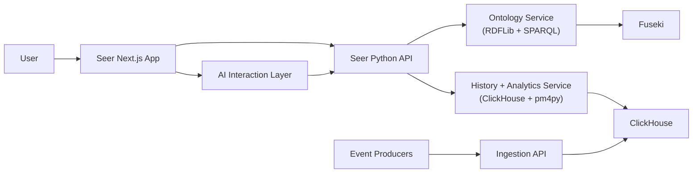

# Seer Product Vision and Strategy

**Status:** Canonical product source of truth  
**Date:** 2026-02-22

---

## 1. Product Vision

Seer is an AI-native operating intelligence platform that helps businesses understand how work actually happens and improve outcomes.

Seer combines:
- ontology-grounded business meaning,
- complete event and object history,
- process mining and analytics,
- and conversational insight workflows.

The product goal is speed to usable process intelligence, not platform complexity.

---

## 2. Product Scope

## 2.1 In Scope

1. Read-only ontology exploration in UI.
2. Ontology ingestion from Prophet local ontology output.
3. SHACL validation against Prophet base metamodel.
4. Upsert of ontology definitions into Fuseki.
5. Event/object history persistence in ClickHouse.
6. Process mining workflows in Python with `pm4py`.
7. AI-assisted analytics and discovery workflows.
8. Ontology-driven field/state display consistency through one shared UI display policy.

## 2.2 Out of Scope (Current Phase)

1. Ontology authoring in Seer UI.
2. Multi-tenant data-layer complexity.
3. Heavy reliability features (dead-letter orchestration, replay subsystem, schema/version compatibility governance).
4. Governance and trust-center feature suites.

---

## 3. Platform Architecture

## 3.1 Stack

- **Backend:** Python
- **Frontend:** React + Next.js
- **Ontology store:** Apache Jena Fuseki
- **Ontology query integration:** RDFLib + SPARQL
- **History store:** ClickHouse
- **Local runtime:** Docker Compose
- **Repository model:** Monorepo

## 3.2 High-Level Topology

## 3.3 Monorepo Layout Intent

The monorepo should keep all platform parts in one repository, including:
- `docker/`
- `seer-backend/`
- `seer-ui/`

Shared packages/docs can be added as needed, but backend, frontend, and runtime infra live together here.

---

## 4. Ontology Strategy

## 4.1 Source of Truth for Authoring

Ontology authoring is config-as-code in Prophet.

Seer UI is explicitly non-authoring for ontology management.

## 4.2 Seer Ontology Responsibilities

1. Accept a Prophet local ontology projection (`gen/turtle/ontology.ttl`).
2. Validate with SHACL against Prophet base metamodel (`prophet.ttl`).
3. Upsert ontology definitions into Fuseki named graphs.
4. Expose read/query APIs for UI and AI context.

## 4.3 Ontology Upsert Identity Contract

Ontology upsert identity is RDF URI based.

Rules:
1. Concept identity is the subject IRI.
2. Property identity is `(subject IRI, predicate IRI, object value/IRI)` triple identity.
3. Upsert unit is a named graph release.
4. Re-ingest of the same release replaces graph contents atomically for that release graph.
5. "Current" graph pointer is switched only after successful SHACL validation.

This gives deterministic ontology state without requiring UI authoring workflows.

## 4.4 Ontology UI Boundary

UI supports:
- ontology graph exploration,
- ontology search and concept inspection,
- ontology context in analytics and AI responses.
- graph-oriented concept discovery sourced from backend-filtered user ontology concepts only.

Ontology explorer constraints:
- concept lists and search results must exclude Prophet base concepts.
- graph visualization must be limited to object/action/event/trigger concepts and their relationships.
- property and custom-type concepts are not shown in ontology graph navigation views.
- user-visible field/state label decisions in inspector flows must be ontology-first through a shared resolver contract.

UI does not support:
- ontology creation/editing,
- ontology publish workflows,
- ontology mutation actions.

---

## 5. Data Model (Current Product Shape)

No derived tables are required for this phase.

Core tables only:
- `event_history`
- `object_history`
- `event_object_links`

## 5.1 `event_history`

Purpose: immutable event log.

Required fields:
- `event_id` UUID
- `occurred_at` DateTime
- `event_type` String
- `source` String
- `payload` JSON

Optional fields:
- `trace_id` String
- `attributes` JSON/map
- `ingested_at` DateTime

Rules:
- `event_id` is UUID.
- Event rows are append-only.

## 5.1.1 Event Time Semantics

Default event-time field for user-facing analytics is `occurred_at`.

`ingested_at` is operational metadata and is not the primary analytics timeline field.

## 5.2 `object_history`

Purpose: immutable snapshots of objects as they appear in event context.

Required fields:
- `object_history_id` UUID
- `object_type` String
- `object_ref` JSON/object key map (raw)
- `object_ref_canonical` String (deterministic canonical form)
- `object_ref_hash` UInt64 or FixedString hash (derived from canonical form)
- `object_payload` JSON
- `recorded_at` DateTime

Optional fields:
- `source_event_id` UUID

Rules:
- `object_history_id` is UUID.
- Every snapshot row is immutable.
- Snapshot granularity for this phase is full object snapshot at event time, not delta.

## 5.3 `event_object_links`

Purpose: connect events to specific object history snapshots and object refs.

Required fields:
- `event_id` UUID
- `object_history_id` UUID
- `object_type` String
- `object_ref` JSON/object key map (raw)
- `object_ref_canonical` String
- `object_ref_hash` UInt64 or FixedString hash

Optional fields:
- `relation_role` String
- `linked_at` DateTime

Rules:
- Each row links an event to a specific object snapshot (`object_history_id`).
- Attributes-at-event-time joins should use `object_history_id`.
- `event_object_links.object_type` must equal the referenced `object_history.object_type`.
- Cross-event object identity traversal should use `(object_type, object_ref_hash)` and validate with `object_ref_canonical`.

## 5.4 Object Ref Normalization Strategy

Composite keys are expected and supported.

Normalization approach:
1. Preserve raw `object_ref` JSON.
2. Build deterministic canonical representation (`object_ref_canonical`) with sorted keys and normalized value formatting.
3. Build `object_ref_hash` from canonical representation for efficient joins/indexing.

This avoids losing fidelity while enabling performant joins.

## 5.5 Why This Shape

This model gives:
- event-first process reconstruction,
- object-first timeline reconstruction,
- direct traversal from an object to co-participating objects via shared events,
- and a clean substrate for object-centric process mining.

---

## 6. Ingestion Model (Pragmatic)

## 6.1 Input Contract

Seer can ingest Prophet wire-envelope events.

Primary fields used in this phase:
- `event_id` (UUID)
- `occurred_at`
- `event_type`
- `source`
- `payload`
- optional `trace_id`
- optional `attributes`
- optional `updated_objects`

`updated_objects` is used to produce `object_history` snapshots and `event_object_links` rows.

## 6.2 Processing Flow

1. Parse input event.
2. Validate required fields and UUID shape for `event_id`.
3. Reject duplicate `event_id`.
4. Persist row to `event_history`.
5. Extract object snapshots (from `updated_objects` and/or payload-mapped refs).
6. Write snapshot rows to `object_history` with UUID history IDs.
7. Write linkage rows to `event_object_links` with event UUID + object history UUID + normalized object refs.

## 6.3 SHACL Usage

SHACL is mandatory for ontology validation against the Prophet base metamodel.

SHACL is not required for the event ingestion path in this phase.

---

## 7. Analytics and Process Mining Strategy

## 7.1 Core Engine

Use `pm4py` as the primary process mining library.

Python is chosen partly to use `pm4py` directly in the analytics service.

## 7.2 Data Access Pattern

Analytics pipeline should read Arrow-backed dataframes from ClickHouse and pass them into Python analysis flows.

Target pattern:
1. Programmatic SQL in Python against ClickHouse.
2. Arrow-backed dataframe retrieval.
3. Lightweight transformation to `pm4py` input structures.
4. Process mining output returned to UI + AI layer.

No external public analytics dataset contract is required yet.

## 7.3 Primary Mining Method (Now)

Focus exclusively on object-centric Petri nets in this phase.

No requirement to support the full matrix of mining techniques yet.

## 7.4 Analysis Anchor

Every analysis run must explicitly define:
1. anchor object type,
2. time window,
3. traversal depth (for RCA paths),
4. outcome definition (for RCA).

The outcome definition is user-driven per run (direct user input or AI-agent-assisted input in UI), and can change over time as new events arrive.

---

## 8. Root Cause Analysis Strategy (Current)

The root-cause workflow is centered on recursive attribute lifting from related objects.

## 8.1 Problem Shape

Given a target object type and outcome (for example delay/failure), identify which attributes or combinations from related objects are most associated with that outcome.

Outcome logic is not fixed globally in this phase; it is configured at analysis time by the user/UI agent.

## 8.2 Pipeline Shape

Use a two-stage pipeline:
1. neighborhood extraction,
2. feature ranking.

## 8.3 Neighborhood Extraction (Pluggable)

The extraction engine is pluggable.

Supported implementation options:
1. iterative SQL joins (default for MVP),
2. recursive SQL patterns,
3. in-memory traversal after SQL seed extraction.

Extraction flow:
1. Start from a seed object cohort.
2. Collect linked events.
3. Collect co-participating object snapshots.
4. Lift attributes across depth.
5. Produce an analysis table keyed by seed object instance.

## 8.4 Ranking Methods in Scope

1. WRAcc for subgroup scoring.
2. Multi-attribute subgroup expansion (beam-style search).
3. Mutual information for high-cardinality features.

---

## 9. Insight Result Contract (What It Is)

The insight result contract is the response shape for an insight shown in UI and AI outputs.

It is not an ontology object model and not a persistence schema.  
It is a product-facing result structure for analytics findings.

Recommended fields:
- `insight_id`
- `title`
- `hypothesis`
- `target_object_type`
- `outcome_definition`
- `coverage`
- `baseline_rate`
- `segment_rate`
- `delta`
- `score` (for example WRAcc)
- `evidence` (trace samples, aggregates, query refs)
- `recommended_actions`

Purpose:
- standardize how insights are rendered,
- standardize what AI can reference,
- standardize what gets exported or shared.

---

## 10. AI Product Strategy by Module

## 10.1 Ontology Copilot (First AI Workflow)

This is the first shipped AI workflow.

Core product surface:
- conversational understanding of ontology concepts,
- ontology graph and concept traversal,
- ontology to process-context explanation.

AI architecture for this workflow:
1. System context includes Prophet base metamodel + current local ontology graph.
2. Tooling is read-only SPARQL execution.
3. Responses include concept URIs and query-backed evidence where applicable.

Why this first:
- ontology is relatively static,
- lower risk than live operational RCA,
- strong immediate user value for understanding domain semantics.

## 10.1.1 AI Response Policy (Current Phase)

Evidence and caveat structure is required for analytical claims.

General ontology Q&A and informational retrieval do not require full analytical-evidence packaging.

## 10.2 Ingestion Monitor

Core product surface:
- basic ingestion health,
- event throughput view,
- event parsing failure summary.

AI usage:
- summarize ingestion anomalies,
- cluster common failure patterns,
- suggest concrete fixes to producers.

## 10.3 Process Explorer

Core product surface:
- object-centric process map,
- timeline exploration,
- object/event drill-down.

AI usage:
- generate guided exploration paths,
- narrate why specific paths dominate,
- suggest follow-up filters/comparisons.

## 10.4 Root Cause Lab

Core product surface:
- configure target object/outcome,
- set recursion depth for attribute lifting,
- run subgroup/ranking analysis,
- inspect ranked hypotheses.

AI usage:
- translate natural-language hypothesis into analysis configuration,
- summarize top candidate causes,
- propose next diagnostic slices.

## 10.5 Insights Dashboard

Core product surface:
- ranked insights feed,
- KPI trend cards,
- saved investigation views.

AI usage:
- daily/weekly narrative summaries,
- change detection narratives,
- action-priority recommendations.

---

## 11. MVP Definition

MVP is complete when users can:
1. Ingest Prophet local ontology Turtle files, validate with SHACL, and upsert to Fuseki.
2. Converse with the ontology copilot using read-only SPARQL-backed responses.
3. Ingest event data with UUID event IDs.
4. Persist object history with UUID history IDs.
5. Persist event-object links tying each event UUID to specific object history UUIDs and normalized object refs.
6. Run object-centric Petri net analysis via `pm4py` using Arrow-backed ClickHouse extracts.
7. Run the pluggable neighborhood-extraction root-cause flow and view ranked insight results.

---

## 12. Delivery Roadmap

Detailed MVP execution roadmap is maintained in:

`docs/exec-plans/completed/mvp-roadmap-2026.md`

This vision document defines strategy and product direction.
The roadmap document defines execution phases, acceptance gates, and release criteria.

---

## 13. Immediate Priorities

1. Finalize ClickHouse schemas for the 3 core tables with UUID fields and object-ref normalization columns.
2. Implement ontology upsert identity behavior in Fuseki using URI-based rules.
3. Implement ingestion mapping from `updated_objects` to history + links.
4. Build Arrow-backed extraction paths for analytics.
5. Implement first object-centric Petri net flow in `pm4py`.
6. Implement pluggable neighborhood extraction for root-cause analysis with iterative SQL as first backend.
7. Ship read-only ontology explorer + ontology copilot as the first AI workflow.

---

## 14. Product Commitment

Seer will deliver practical, fast process intelligence centered on:
- Prophet-based ontology ingestion and validation,
- complete event/object/link history with UUID identities,
- object-centric process mining in Python,
- and AI-assisted investigation workflows.
