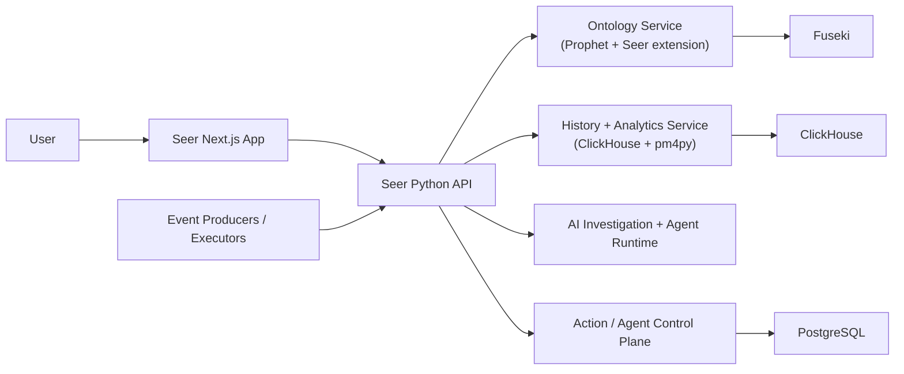

# Seer Product Vision and Strategy

**Status:** Canonical product source of truth  
**Date:** 2026-03-07

---

## 1. Product Definition

Seer is an ontology-grounded AI operations platform.

Seer helps a business do two things:

1. investigate how the business is operating right now using AI, and
2. run managed AI agents that can inspect business history and execute approved capabilities.

In plain language:

1. Prophet defines the business vocabulary and capability model.
2. Seer stores operational history as events, objects, and relationships over time.
3. AI uses that ontology and history to investigate what is happening.
4. Managed agents use that same ontology and history to decide what to do next and invoke approved actions.

The product goal is not "more dashboards" or "more workflow plumbing."

The product goal is to give businesses an AI-native operating layer that can understand the business model, inspect evidence, and safely take action.

---

## 2. What Seer Is And Is Not

## 2.1 What Seer Is

1. An AI-first investigation product for understanding business operations.
2. A managed runtime for ontology-defined actions and workflows.
3. A product that uses complete operational history as evidence.
4. A product where analytics exist to improve investigation quality and execution quality.

## 2.2 What Seer Is Not

1. Not an ontology authoring product.
2. Not a generic low-code workflow compiler.
3. Not primarily a process-mining diagram tool.
4. Not a separate action-registry platform detached from the ontology.

---

## 3. Core Product Model

Seer has four product layers.

## 3.1 Ontology Layer

The ontology is the business meaning layer and the capability catalog.

It defines:

1. business objects,
2. business events,
3. lifecycle states and transitions,
4. executable actions and workflows,
5. typed inputs and produced events,
6. and Seer-specific execution concepts layered on top of Prophet.

## 3.2 Evidence Layer

Seer stores complete operational history so AI can reason from evidence rather than from static metadata alone.

The evidence layer includes:

1. immutable event history,
2. immutable object snapshots over time,
3. normalized event-object relationships,
4. and analytical artifacts derived from that history.

## 3.3 Investigation Layer

Investigation is AI-first.

Users should primarily ask questions in business language such as:

1. what is causing delayed fulfillment,
2. which customers are at risk,
3. what changed this week,
4. or what should we do next.

Seer should decide how to investigate:

1. inspect ontology context,
2. query history,
3. compare cohorts,
4. run process-mining or root-cause tools when useful,
5. and return evidence, caveats, and recommended next actions.

## 3.4 Execution Layer

Execution is action-first.

Managed agentic workflows are treated as executable ontology-defined workflows/actions.

From the rest of the platform's point of view:

1. atomic actions are executable capabilities,
2. agentic workflows are also executable capabilities,
3. both live in the ontology,
4. and Seer provides the runtime that can execute them safely.

---

## 4. Product Surfaces

## 4.1 AI Investigation

This is the primary user-facing product surface.

The user starts with a business question, not a diagram configuration form.

Seer should:

1. understand the question in ontology terms,
2. inspect relevant operational evidence,
3. choose the right analytical tools,
4. explain findings in plain language,
5. show evidence and caveats,
6. and suggest or invoke next actions when allowed.

## 4.2 Managed Agents

Users should be able to register managed AI agents that pursue an operational objective over time.

Examples:

1. recover at-risk orders before SLA breach,
2. triage overdue invoices,
3. watch for procurement exceptions,
4. or monitor low-stock risk and initiate replenishment.

The managed agent is not compiled into a rigid workflow graph.

The definition is the ontology-defined workflow capability plus its operating instruction and runtime guardrails inside Seer.

## 4.3 Expert Drill-Down

Process mining, RCA, history inspection, and ontology exploration still matter.

They remain available as:

1. tools the AI investigator can call,
2. tools managed agents can call when permitted,
3. and expert drill-down surfaces for verification and deeper analysis.

They are important product modules, but they are no longer the primary product identity.

---

## 5. Product Scope

## 5.1 In Scope

1. Read-only ontology exploration in UI.
2. Ontology ingestion from Prophet local ontology output and Seer ontology extensions.
3. SHACL validation against the Prophet base metamodel and Seer extension contracts.
4. Upsert of ontology definitions into Fuseki.
5. Event, object, and relationship history persistence in ClickHouse.
6. Managed action orchestration and agent runtime control-plane state in PostgreSQL.
7. AI-first investigation workflows.
8. Ontology-defined executable actions and managed workflow execution.
9. Evidence-backed analytical tooling such as process mining and RCA.
10. Shared UI for evidence, caveats, runtime guardrails, and execution visibility.

## 5.2 Out Of Scope (Current Phase)

1. Ontology authoring in Seer UI.
2. A separate action catalog outside the ontology.
3. Workflow compilation into fixed DAG/spec artifacts as the canonical execution model.
4. Multi-tenant data-layer complexity.
5. Governance and trust-center feature suites.
6. Broker-first/global replay orchestration platforms and schema/version compatibility governance.

---

## 6. Platform Stack

## 6.1 Canonical Stack

- **Backend:** Python
- **Frontend:** React + Next.js
- **Ontology store:** Apache Jena Fuseki
- **Ontology query integration:** RDFLib + SPARQL
- **History store:** ClickHouse
- **Action and agent control-plane store:** PostgreSQL
- **Local runtime:** Docker Compose
- **Repository model:** Monorepo

## 6.2 High-Level Topology

---

## 7. Ontology Strategy

## 7.1 Source Of Truth For Authoring

Ontology authoring remains config-as-code in Prophet.

Seer consumes ontology releases; Seer UI is not a general ontology authoring environment.

## 7.2 Seer Ontology Responsibilities

Seer must:

1. ingest Prophet-generated local ontology projections,
2. validate them,
3. upsert them into Fuseki,
4. expose them to UI and AI,
5. and use them as the executable capability catalog.

## 7.3 Seer Ontology Extension

Seer extends Prophet with a Seer execution ontology.

That extension should define the concepts needed for managed AI execution, including:

1. managed agentic workflow shape,
2. runtime guardrail metadata,
3. execution-safety semantics,
4. allowed evidence/tool access,
5. and runtime outcome semantics.

The extension should build on Prophet `Action` and `Workflow` primitives rather than creating a disconnected execution model.

## 7.4 Ontology Identity Contract

Ontology upsert identity is RDF URI based.

Rules:

1. Concept identity is the subject IRI.
2. Property identity is `(subject IRI, predicate IRI, object value/IRI)` triple identity.
3. Upsert unit is a named graph release.
4. Re-ingest of the same release replaces graph contents atomically for that release graph.
5. The current graph pointer switches only after successful validation.

## 7.5 Ontology UI Boundary

UI supports:

1. ontology graph exploration,
2. ontology search and concept inspection,
3. ontology context in investigation and execution surfaces,
4. and concept discovery sourced from backend-filtered user ontology concepts only.

UI does not support:

1. ontology creation/editing,
2. ontology publish workflows,
3. or ad hoc ontology mutation.

---

## 8. Data And Runtime Model

## 8.1 Evidence Plane

Seer uses immutable operational history as the core evidence plane.

Canonical history tables:

1. `event_history`
2. `object_history`
3. `event_object_links`

This model exists so AI and analytics can:

1. reconstruct object timelines,
2. reconstruct process behavior,
3. inspect state at event time,
4. and traverse relationships across objects via shared events.

## 8.2 Control Plane

Seer uses PostgreSQL as the control plane for actions and managed agents.

Canonical control-plane tables:

1. `actions`
2. `action_attempts`
3. `instances`
4. `action_dead_letters`

This plane tracks:

1. execution ownership,
2. retries and failures,
3. execution lifecycle visibility,
4. and the safe runtime state of managed execution.

---

## 9. AI Investigation Strategy

## 9.1 Default Interaction Model

The default investigation experience starts with a question, not with manual analytics setup.

The user should be able to ask:

1. what is happening,
2. why it is happening,
3. what changed,
4. what will likely happen next,
5. and what action should be taken.

## 9.2 Investigation Responsibilities

The AI investigator should be able to:

1. interpret the question using ontology concepts,
2. inspect relevant object and event history,
3. run structured analytical tools when needed,
4. synthesize findings,
5. cite evidence,
6. state caveats,
7. and hand off into expert drill-down surfaces when helpful.

## 9.3 Role Of Process Mining And RCA

Process mining and RCA remain important, but their role changes.

They are:

1. analytical tools that improve AI investigation quality,
2. expert validation surfaces,
3. and reusable reasoning tools for managed agents.

They are not the product's primary entry point.

---

## 10. Managed Agent Strategy

## 10.1 Managed Agent Definition

A managed agent is a Seer-run executable workflow that is defined in the ontology and operates over business evidence inside Seer's runtime.

The agent should be able to:

1. inspect object and event history,
2. call allowed analytical tools,
3. invoke approved ontology-defined actions,
4. make adaptive decisions based on live evidence,
5. and report outcomes.

## 10.2 What Is Persisted

Seer should persist:

1. the ontology-defined workflow/action identity,
2. the operating instruction,
3. runtime guardrails and execution limits,
4. trusted-mode operating settings for the current phase,
5. run history and audit evidence,
6. and outcome tracking.

Seer should not require compilation into a rigid workflow graph as the canonical model.

## 10.3 Safe Runtime Principles

The hard problem for Seer is safe execution, not workflow graph generation.

The runtime must provide:

1. bounded tool and action access,
2. runtime limits and stop conditions,
3. data access scoping,
4. idempotent action semantics,
5. retry and failure handling,
6. and auditability.

## 10.4 Agents As Actions

From the rest of the system's point of view, a managed agentic workflow is just another executable action/workflow capability.

That keeps the model clean:

1. atomic processes are actions,
2. higher-order managed agents are also actions,
3. the ontology remains the single executable catalog,
4. and Seer remains the runtime, not a separate ontology-independent workflow authoring system.

---

## 11. Product Experience Principles

1. Start from user intent in business language.
2. Keep the ontology as the shared meaning and capability layer.
3. Prefer evidence-backed explanation over black-box AI answers.
4. Treat process mining and RCA as power tools, not mandatory first-step UX.
5. Make execution safe, observable, and interruptible.
6. Explain concepts in plain language before implementation detail.

---

## 12. Immediate Priorities

1. Document the new product model clearly across vision, design, architecture, and specs.
2. Define the Seer ontology extension for managed agent execution.
3. Design the safe agent runtime and trusted-mode guardrail model.
4. Define AI-first investigation product behavior before more analytics-surface expansion.
5. Align action orchestration with the managed-agent runtime rather than treating them as separate product tracks.

---

## 13. Product Commitment

Seer will deliver an AI-native operating layer centered on:

1. Prophet-grounded business meaning,
2. complete operational history,
3. AI-first investigation,
4. ontology-defined executable capabilities,
5. and managed agents that can reason over evidence and invoke approved actions safely.
